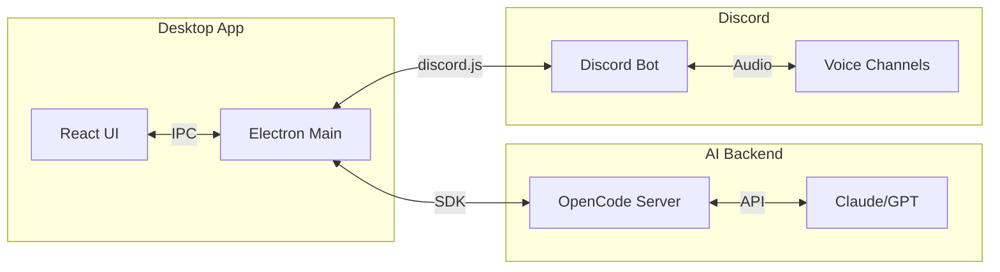
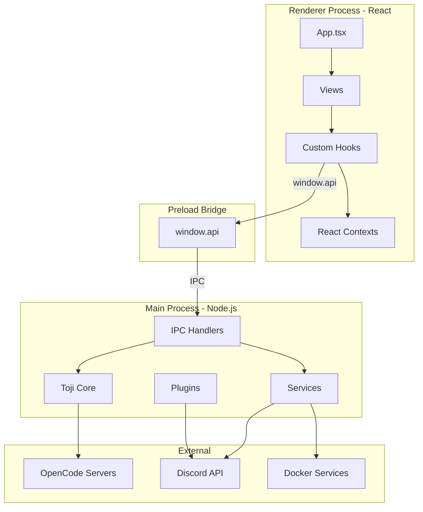
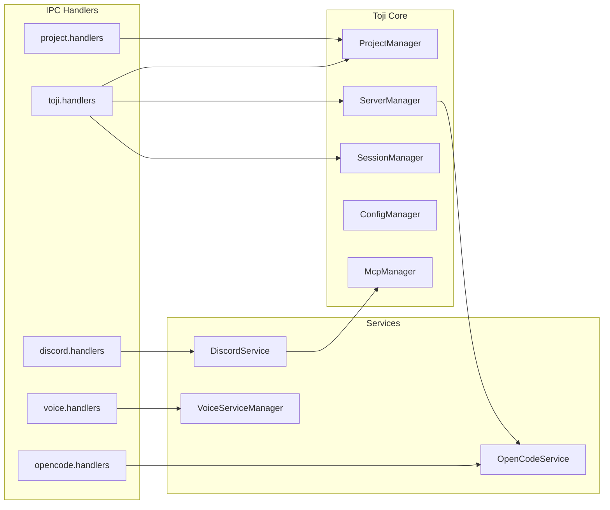
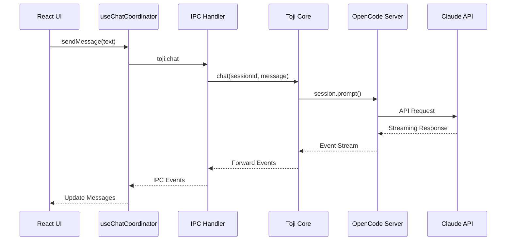
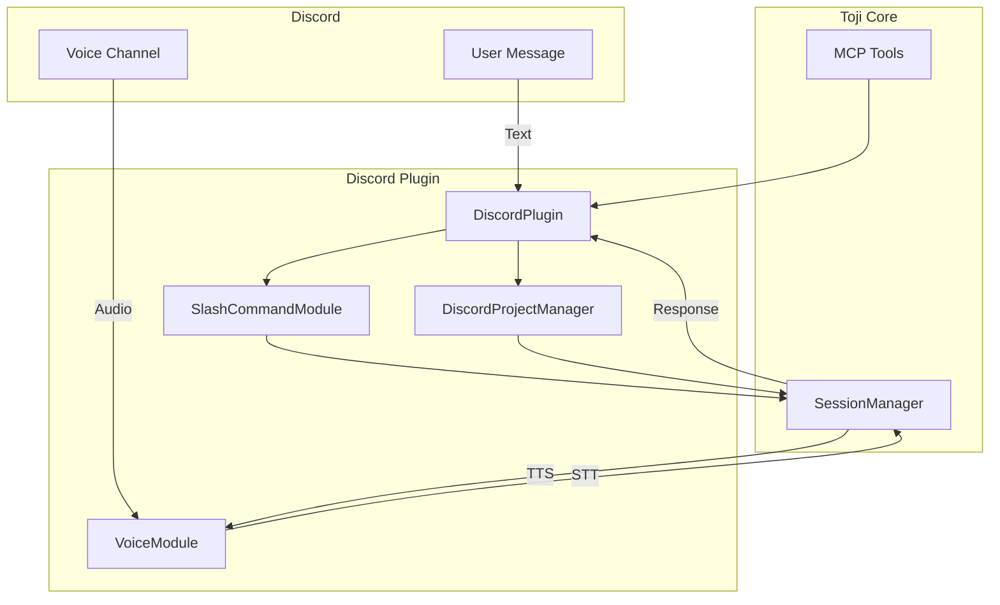
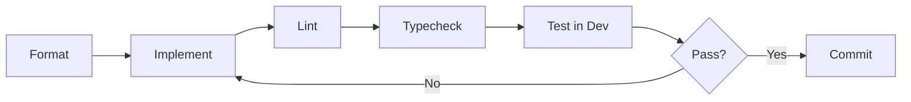

# Toji3

AI-Powered Development Desktop Application with OpenCode Integration and Discord Bot

## Overview

Toji3 is an Electron desktop application that brings AI-assisted development to your workflow through a native GUI and Discord integration. It wraps the [OpenCode SDK](https://github.com/sst/opencode) to provide multi-project AI sessions with voice capabilities.



## Features

- **Multi-Project Sessions** - Run separate OpenCode servers per project with independent contexts
- **Discord Bot Integration** - AI assistant accessible through Discord text and voice channels
- **Voice Conversations** - Speech-to-text and text-to-speech via Docker-based Whisper and Piper
- **MCP Tools** - Model Context Protocol tools for Discord channel management
- **Project Initialization** - Automatic AGENTS.md generation for new projects

## Architecture

### High-Level Architecture



### Main Process Structure



### Data Flow: Chat Session



### Discord Integration



### Voice Processing Pipeline

```mermaid
flowchart LR
    subgraph Input["Audio Input"]
        UserSpeech[User Speech]
        Opus1[Opus Decoder]
    end

    subgraph STT["Speech-to-Text"]
        Whisper[Whisper Docker]
    end

    subgraph AIProc["AI Processing"]
        OCSession[OpenCode Session]
    end

    subgraph TTS["Text-to-Speech"]
        Piper[Piper Docker]
    end

    subgraph Output["Audio Output"]
        FFmpeg[FFmpeg Transcode]
        Opus2[Opus Encoder]
        BotVoice[Bot Voice]
    end

    UserSpeech -->|Opus| Opus1
    Opus1 -->|PCM 16kHz| Whisper
    Whisper -->|Text| OCSession
    OCSession -->|Response| Piper
    Piper -->|WAV| FFmpeg
    FFmpeg -->|PCM| Opus2
    Opus2 --> BotVoice
```



### Technology Stack

| Layer | Technology |
|-------|------------|
| Desktop Framework | Electron 37 |
| Build Tool | electron-vite |
| Frontend | React 19, TypeScript 5.8 |
| UI Components | Chakra UI v3 |
| AI Integration | OpenCode SDK |
| Discord | discord.js 14 |
| Voice | @discordjs/voice, Whisper, Piper |
| MCP | @modelcontextprotocol/sdk |

## Installation

### For Users (Pre-built Release)

1. **Download the Installer**
   - Visit the [Releases page](https://github.com/krenuds/toji3/releases)
   - Download `Toji3-Setup-X.X.X.exe` for Windows
   - Download `Toji3-X.X.X.dmg` for macOS
   - Download `Toji3-X.X.X.AppImage` for Linux

2. **Install OpenCode Binary** (Required)

   ```bash
   # The app will prompt you to install on first run, or install manually:
   npm install -g @opencode-ai/cli
   ```

3. **Configure API Keys**
   - Launch Toji3
   - Navigate to Settings (gear icon)
   - Add your OpenAI API key (or other provider)
   - API keys are stored securely in your OS keychain

4. **Optional: Discord Integration**
   - Create a Discord application at [Discord Developer Portal](https://discord.com/developers)
   - Copy the Bot Token
   - Add it in Toji3 Settings → Discord Integration
   - Invite the bot to your server using the generated OAuth2 URL

5. **Optional: Voice Features** (Requires Docker)
   - Install [Docker Desktop](https://www.docker.com/products/docker-desktop)
   - Voice features will auto-initialize on first use
   - First-time setup builds Docker images (5-10 minutes)

### For Developers (Build from Source)

#### Prerequisites

- **Node.js 18+**: [Download](https://nodejs.org/)
- **Git**: [Download](https://git-scm.com/)
- **Visual Studio Build Tools** (Windows only): Required for native modules
- **Docker Desktop** (Optional): For voice features development

#### Setup Steps

1. **Clone the Repository**

   ```bash
   git clone https://github.com/krenuds/toji3.git
   cd toji3
   ```

2. **Install Dependencies**

   ```bash
   npm install
   ```

3. **Install OpenCode CLI**

   ```bash
   npm install -g @opencode-ai/cli
   ```

4. **Configure Development Environment**

   ```bash
   # Create .env file (optional, for custom configs)
   cp .env.example .env

   # Edit .env with your preferences
   ```

5. **Run Development Server**

   ```bash
   npm run dev
   ```

   This starts:
   - Electron main process with hot reload
   - Vite dev server for renderer (React)
   - TypeScript watch mode for type checking

#### Development Workflow



```bash
# Format code (Prettier)
npm run format

# Lint code (ESLint)
npm run lint

# Type check
npm run typecheck        # Check all
npm run typecheck:node   # Check main/preload only
npm run typecheck:web    # Check renderer only

# Generate architecture visualization
npm run graph

# Build for production
npm run build:win        # Windows
npm run build:mac        # macOS
npm run build:linux      # Linux
```

#### Quality Gates (Run Before Committing)

```bash
npm run format && npm run lint && npm run typecheck
```

All three must pass with zero errors before committing.

## Project Structure

```
toji3/
├── src/
│   ├── main/                    # Electron main process
│   │   ├── index.ts            # Entry point, IPC handler registration
│   │   ├── toji/               # Core Toji API (OpenCode integration)
│   │   │   ├── index.ts        # Main Toji class
│   │   │   ├── sessions.ts     # Session management
│   │   │   ├── project.ts      # Project lifecycle
│   │   │   ├── server.ts       # OpenCode server manager
│   │   │   └── mcp/            # Model Context Protocol tools
│   │   ├── handlers/           # IPC handlers (thin wrappers)
│   │   ├── services/           # Supporting services
│   │   │   ├── discord-service.ts
│   │   │   ├── docker-service-manager.ts
│   │   │   ├── whisper-client.ts
│   │   │   └── piper-client.ts
│   │   ├── config/             # Configuration management
│   │   └── utils/              # Utilities (logger, paths, etc.)
│   │
│   ├── preload/                 # Electron preload scripts
│   │   ├── index.ts            # Main preload entry
│   │   └── api/                # Type-safe IPC API definitions
│   │
│   ├── renderer/                # React frontend
│   │   └── src/
│   │       ├── components/     # React components
│   │       │   ├── views/      # Main views (Chat, Integrations)
│   │       │   └── shared/     # Reusable components
│   │       ├── hooks/          # Custom React hooks
│   │       ├── contexts/       # React Context providers
│   │       └── theme.ts        # Chakra UI theme tokens
│   │
│   └── plugins/                 # Interface plugins
│       └── discord/            # Discord bot plugin
│           ├── DiscordPlugin.ts
│           ├── commands/       # Slash commands
│           ├── modules/        # Feature modules
│           └── voice/          # Voice communication
│
├── resources/                   # Static resources
│   └── docker-services/        # Docker configs for STT/TTS
│       ├── whisper-service/    # Speech-to-text (Whisper)
│       └── piper-service/      # Text-to-speech (Piper)
│
├── docs/                        # Project documentation
│   ├── refactoring/            # Refactoring initiative docs
│   ├── guides/                 # Usage guides and best practices
│   └── README.md               # Documentation index
│
├── SPEC/                        # Technical specifications
│   ├── OPENCODE.md             # OpenCode SDK integration
│   ├── DISCORD_VOICE_SYSTEM.md # Voice feature architecture
│   ├── FRONTEND.md             # React/Chakra UI guidelines
│   └── STTTTS.md               # Speech services implementation
│
└── graphs/                      # Architecture visualizations
    └── AGENTS.md               # Development agent guidelines
```

## Key Concepts

### Projects

Projects are the top-level organizational unit in Toji3. Each project:

- Has its own OpenCode server instance (dedicated port)
- Maintains separate session history
- Can have its own `opencode.json` configuration
- Gets a dedicated Discord category and channels (if Discord enabled)

### Sessions

Sessions represent individual conversations with the AI:

- Scoped to a specific project
- Persist across app restarts
- Can be resumed at any time
- Support branching conversations
- Include full message history with tool calls

### MCP Tools

Model Context Protocol tools extend OpenCode's capabilities:

- **Discord Tools**: Message sending, channel management, search
- **Session Tools**: Read/list past sessions
- **Project Tools**: Initialize new projects with Git
- Extensible architecture for custom tools

### Voice Communication

Voice features use Docker-based services:

- **Whisper**: OpenAI's speech recognition (STT)
- **Piper**: High-quality text-to-speech (TTS)
- Real-time processing with VAD (Voice Activity Detection)
- Automatic transcription embeds in Discord channels

## Development Guidelines

### Architecture Principles

1. **Main Process First**: All business logic lives in main process
2. **Thin IPC Handlers**: Maximum 5 lines, just forward to Toji class
3. **Chakra UI Exclusively**: No CSS files, no inline styles
4. **Full TypeScript Typing**: Never use `any` at boundaries
5. **Hooks Abstract window.api**: Components never access window.api directly

### Code Style

- **Formatting**: Prettier with 100 character line length
- **Linting**: ESLint with TypeScript rules
- **Commits**: Conventional commit format (`feat:`, `fix:`, `docs:`, etc.)
- **Type Safety**: Strict TypeScript mode enforced

### Testing

```bash
# Run linting
npm run lint

# Type checking
npm run typecheck

# Architecture validation
npm run graph  # Check for dependency violations
```

### Adding Features

1. **Research**: Check relevant specs in `SPEC/` folder
2. **Plan**: Design with proper separation of concerns
3. **Implement**: Follow this order:
   - API Layer (Toji class method)
   - IPC Handler (thin wrapper)
   - Preload Bridge (type-safe exposure)
   - UI Hook (abstract window.api)
   - View Component (use hook)
4. **Quality Gates**: Format → Lint → Type check
5. **Document**: Update relevant spec files
6. **Commit**: Use conventional commit format

## Configuration

### Application Config

Located at `%APPDATA%/toji3/config.json` (Windows) or `~/Library/Application Support/toji3/config.json` (macOS):

```json
{
  "currentProject": "path/to/project",
  "windowState": { ... },
  "theme": "dark"
}
```

### Project Config (`opencode.json`)

Each project can have its own OpenCode configuration:

```json
{
  "model": "anthropic/claude-3-5-sonnet-20241022",
  "temperature": 0.7,
  "mcpServers": {
    "toji-mcp": {
      "type": "http",
      "url": "http://localhost:3100"
    }
  }
}
```

### Discord Bot Config

Store Discord bot token in Settings:

- Token is encrypted and stored in OS keychain
- Automatically reconnects on app restart
- Supports multiple servers simultaneously

## Troubleshooting

### OpenCode Binary Not Found

```bash
# Install globally
npm install -g @opencode-ai/cli

# Verify installation
opencode --version
```

### Voice Features Not Working

**Development Mode**: Voice works out of the box with `npm run dev`

**Production Mode**: Known limitation - Docker PATH issues in packaged apps

- Voice features currently only work in development
- Production voice support is under development

### Discord Bot Not Connecting

1. Check token is valid in Discord Developer Portal
2. Verify bot has required intents enabled:
   - GUILDS
   - GUILD_MESSAGES
   - GUILD_VOICE_STATES
   - MESSAGE_CONTENT
3. Check logs: `%APPDATA%/toji3/logs/` (Windows)

### Build Errors

```bash
# Clean install
rm -rf node_modules package-lock.json
npm install

# Rebuild native modules
npm run postinstall
```

## Logs

Application logs are stored at:

- **Windows**: `C:\Users\{user}\AppData\Roaming\toji3\logs\`
- **macOS**: `~/Library/Application Support/toji3/logs/`
- **Linux**: `~/.config/toji3/logs/`

Log files are named `toji-YYYY-MM-DD.log` and include:

- Startup sequence
- OpenCode server status
- Discord connection events
- Session operations
- Error stack traces

## Contributing

This is a proof-of-concept project demonstrating architecture patterns. The production version is under development. However, we welcome:

- Bug reports
- Architecture feedback
- Documentation improvements
- Feature suggestions

Please open issues on GitHub for any feedback.

## Roadmap

**Current Status**: Proof of Concept (v0.2.0)

**Planned for Production Version**:

- [ ] Production-ready voice services (no Docker dependency)
- [ ] Multi-user workspace support
- [ ] Cloud sync for sessions and projects
- [ ] Plugin marketplace for custom MCP tools
- [ ] Team collaboration features
- [ ] Advanced prompt engineering tools
- [ ] Session branching and merging UI
- [ ] Export conversations to various formats
- [ ] Web-based interface (alongside desktop)
- [ ] Mobile companion app

## License

See LICENSE file for details.

## Acknowledgments

- **OpenCode SDK**: [github.com/sst/opencode](https://github.com/sst/opencode)
- **Discord.js**: [discord.js.org](https://discord.js.org)
- **Whisper**: [github.com/openai/whisper](https://github.com/openai/whisper)
- **Piper TTS**: [github.com/rhasspy/piper](https://github.com/rhasspy/piper)

## Documentation

### Technical Specifications

See [`SPEC/`](SPEC/) folder for detailed technical specifications:

- [SPEC/FRONTEND.md](SPEC/FRONTEND.md) - Frontend development guide
- [SPEC/OPENCODE.md](SPEC/OPENCODE.md) - OpenCode SDK reference
- [SPEC/DISCORD_VOICE_SYSTEM.md](SPEC/DISCORD_VOICE_SYSTEM.md) - Voice system design
- [SPEC/STTTTS.md](SPEC/STTTTS.md) - STT/TTS implementation details

### Architecture Graphs

Generate fresh architecture diagrams:

```bash
npm run graph
```

Output files in `graphs/`:
- `architecture.svg` - Visual dependency graph (open in browser)
- `architecture.dot` - Source graph definition

## Discord Bot Commands

| Command | Description |
|---------|-------------|
| `/init` | Initialize AI for the current channel |
| `/clear` | Clear conversation history |
| `/project list` | List available projects |
| `/project switch <name>` | Switch to a different project |
| `/voice join` | Join voice channel for voice chat |
| `/voice leave` | Leave voice channel |
| `/admin status` | Show bot status |
| `/help` | Show available commands |

## Support

- **Issues**: [GitHub Issues](https://github.com/krenuds/toji3/issues)
- **Architecture Diagrams**: Run `npm run graph` to generate

## License

MIT
